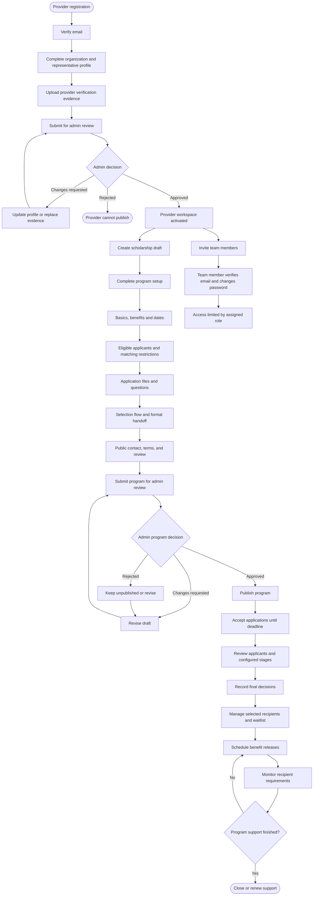
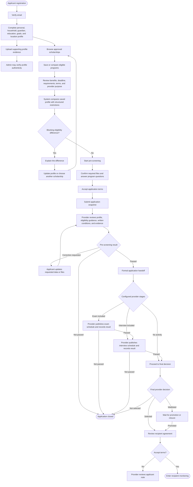
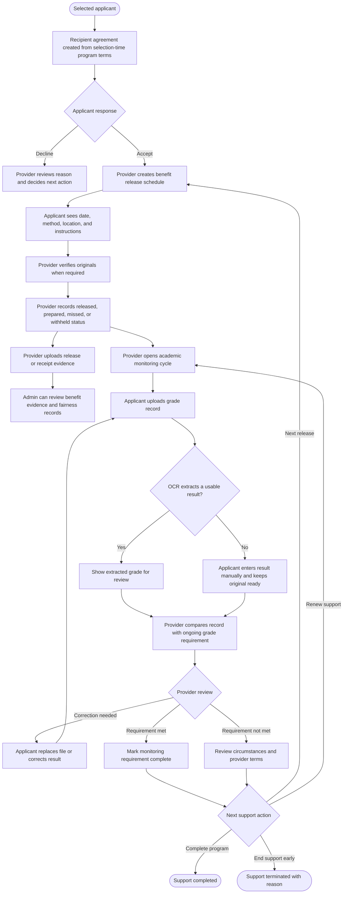
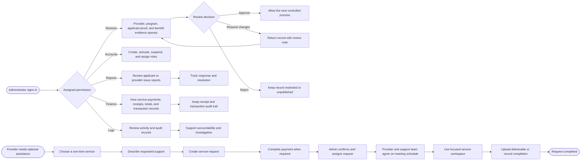

# Scholarship Platform Process Flowcharts

These flowcharts describe the processes currently implemented in the Scholarship Portal. Matching and decision-support results guide reviewers; they do not replace provider decisions or in-person verification of original documents.

## 1. Overall Platform Flow

```mermaid
flowchart LR
    A([User enters platform]) --> B{Account type}
    B -->|Applicant| C[Verify email and complete profile]
    B -->|Provider| D[Verify email and submit organization evidence]
    B -->|Administrator| E[Use assigned role and permissions]

    D --> F[Admin reviews provider]
    F --> G{Provider approved?}
    G -->|Changes needed| D
    G -->|Yes| H[Create scholarship draft]
    H --> I[Admin reviews scholarship]
    I --> J{Program approved?}
    J -->|Revise| H
    J -->|Yes| K[Publish scholarship]

    C --> L[Find, save, and compare scholarships]
    K --> L
    L --> M[Profile matching and eligibility guidance]
    M --> N{Required blockers present?}
    N -->|Yes| O[Update profile or choose another program]
    O --> L
    N -->|No| P[Submit pre-screening application]

    P --> Q[Provider reviews profile, conditions, and files]
    Q --> R{Pass current stage?}
    R -->|Correction needed| S[Applicant corrects information or files]
    S --> Q
    R -->|No| T([Application closed])
    R -->|Yes| U[Complete configured formal application, exam, or interview stages]
    U --> V{Final decision}
    V -->|Not selected| T
    V -->|Waitlisted| W[Remain on waitlist]
    W -->|Promoted| X[Selected applicant]
    W -->|Closed| T
    V -->|Selected| X

    X --> Y[Applicant reviews recipient agreement]
    Y --> Z{Agreement accepted?}
    Z -->|No| AA[Provider reviews declined response]
    Z -->|Yes| AB[Benefit release and recipient monitoring]
    AB --> AC{Support decision}
    AC -->|Renew| AB
    AC -->|Complete| AD([Scholarship support completed])
    AC -->|End early| AE([Scholarship support terminated])

    E -. oversees .-> F
    E -. oversees .-> I
    E -. reviews evidence .-> AB
```

## 2. Provider and Program Lifecycle

## 3. Applicant Application and Selection Flow

## 4. Benefit Release and Recipient Monitoring

## 5. Administrator, Reports, Finance, and Provider Services

## Diagram Notes

- Profile matching is guidance. Required structured blockers control whether pre-screening can start, while written provider conditions are confirmed during review.
- Exam and interview stages are optional and depend on the program's configured selection flow.
- Online files support initial checking. Providers may still require original documents for complete verification.
- The application deadline stops new applications; already submitted applications continue through review and selection.
- Services are optional one-time provider support requests, not subscriptions and not part of applicant selection.
- Recipient monitoring begins only after selection and acceptance of the recipient agreement.
